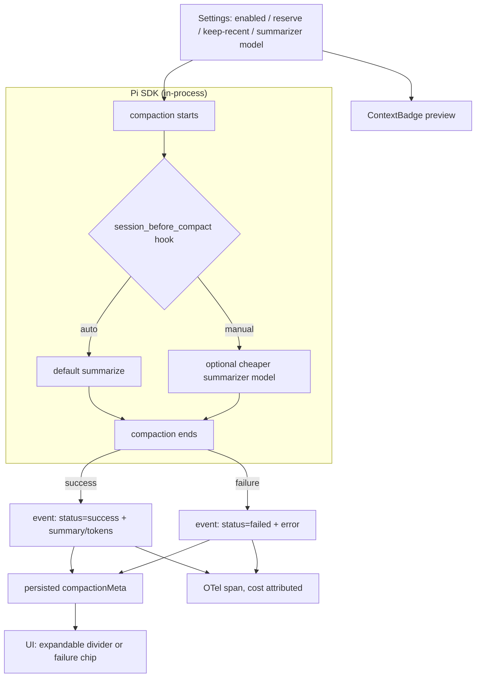

# Context Compaction

Compaction — the SDK's summarization of older turns into one entry so the
context window doesn't overflow — is treated as a **visible lifecycle
event**, not backend plumbing: shown while running, inspectable afterward,
user-controllable, and cost-attributed. Same treatment a tool call gets.

**Pi backend only** (GitHub Copilot / local / OpenAI-compatible). The Claude
Agent SDK's compaction is opaque — its `compact_boundary` events are
consumed for display, but nothing here can configure, hook, or manually
trigger it.

## Where things live

| Concern | File |
|---|---|
| Event model + Pi/Claude adapters | `src/main/agent/events.ts`, `src/main/pi-server/event-adapter.ts` |
| Session settings, manual-trigger handling, OTel span | `src/main/pi-server/index.ts` |
| Manual-compact IPC | `src/main/ipc.ts` (`chat:manualCompact`), `src/main/agent/backends/pi/agent.ts` |
| Settings (defaults + shape) | `src/main/storage/settings.ts` |
| Persisted `compactionMeta` | `src/main/storage/sessions.ts` |
| Settings UI | `src/renderer/src/components/settings/panels/AIPanel.tsx` |
| Divider (success + failure states) | `src/renderer/src/components/chat/message-list/CompactionDivider.tsx` |
| Manual trigger button + preview badge | `src/renderer/src/components/chat/message-input/MessageToolbar.tsx`, `.../ContextBadge.tsx` |
| Fork "with context" | `src/main/storage/session-fork.ts`, `src/main/storage/sessions.ts` |

## Architecture

## Design points

**One event model, two backends.** Pi and Claude expose physically
different compaction signals; both map into the same internal
`compaction` event (`status: success | failed`, `trigger`, token counts,
optional summary/file lists). `status` is always set explicitly by the
adapter — never inferred from other fields — so a failed compaction can't
render as a successful one.

**Settings, one source of truth.** Auto-compact on/off, the token
threshold, how much recent history stays verbatim, and an optional
cheaper summarizer model all live in one settings object. That same object
feeds both session construction and the context-usage badge's "compacts
near ~X%" preview, so the preview can't drift from what actually triggers
compaction.

**`session_before_compact` hook.** Used two ways: attributing an OTel span
to auto-triggered compactions, and — manual trigger only — swapping in a
cheaper model plus instructing the summarizer to preserve any in-flight
multi-phase plan state verbatim (this app's planning feature has no
general-purpose way to signal "don't paraphrase this" otherwise).

**Concurrency.** A manual compaction and a real chat turn must never run
against the session at the same time (wrong model, misrouted events). This
is enforced at the subprocess level, not just by disabling the input in the
UI.

**Fork with context.** Branching a session can either hard-cut history at
the fork point (default) or attach a generated summary of the abandoned
tail, reusing the SDK's own branch-summarization machinery. Any failure to
summarize falls back to a clean cutoff — forking must never fail outright
because summarization wasn't available.

## UI states

- **Running** — a transient status line, worded differently for a
  threshold compaction, an overflow-recovery compaction (more urgent — the
  previous turn nearly failed), and a manual one.
- **Success** — a divider chip with tokens saved, expandable to the
  generated summary and touched files.
- **Failure** — a visually distinct chip with the error message, never the
  success chip.
- **Manual trigger** — a toolbar button, disabled for Anthropic connections,
  empty sessions, and while a turn is streaming.

## Observability

Every compaction (manual or auto) gets an OTel span with the standard
GenAI attributes plus reason/token counts, so compaction cost shows up in
the same per-user dashboards as regular turns instead of being folded
invisibly into the turn. See [`OTEL.md`](OTEL.md) for the span model this
reuses.

## Guardrails (when changing this)

- Never infer `status` — set it explicitly at every emit site.
- Settings numbers have exactly one source of truth; don't reintroduce a
  UI-local hardcoded threshold.
- Summarizer-model override stays manual-trigger only — the automatic path
  has no safe way to swap models mid-flight without racing the active turn.
- Auto-compactions that get aborted must still close out their OTel span.
- A manual compaction and a prompt turn must never execute concurrently.
- A fork must never fail because context-summarization failed — always
  fall back to a clean cutoff.

## Explicitly out of scope

- Per-provider/per-model override of the compaction thresholds.
- Automatic detection of "important" content beyond plan-tracking state.
- Any change to the Claude Agent SDK's own compaction behavior.
