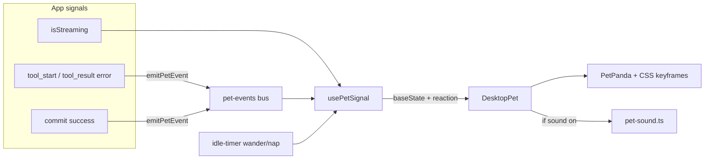

# Desktop Pet

A decorative panda overlay that reflects real app activity instead of just sitting there — a small ambient signal of
"the agent is working," not a Clippy-style assistant. Off by default; disabled, it costs nothing.

## Where things live

| Concern                         | File                                        |
|---------------------------------|---------------------------------------------|
| Enable/mount gate (lazy import) | `components/pet/DesktopPetGate.tsx`         |
| Position, drag, motion loops    | `components/pet/DesktopPet.tsx`             |
| Drag-release momentum physics   | `lib/pet-motion.ts`                         |
| Idle cursor-gaze tracking       | `components/pet/useCursorGaze.ts`           |
| Shared reduced-motion check     | `components/pet/usePrefersReducedMotion.ts` |
| Reaction/state machine          | `components/pet/usePetSignal.ts`            |
| Signal bus (app → pet)          | `lib/pet-events.ts`                         |
| Sound synthesis                 | `lib/pet-sound.ts`                          |
| Settings                        | `lib/app-settings.ts`                       |

## Architecture

`isStreaming` is passed straight down as a prop (it already lives at the
`App.tsx` level). Everything else — tool activity, commit success — has no natural prop path to the pet, so it goes
through a tiny renderer-global pub/sub instead of threading props through several unrelated components.
`usePetSignal` is the single point where all of that becomes one state:
a **base state** (what the pet is doing when nothing is happening) plus a transient **reaction** (a brief overlay
animation on top of it).

## Design points

**Reactions are transient, streaming is held.** Every signal except
`isStreaming` fires a reaction that plays out and returns to whatever base state it interrupted. `isStreaming` is the
one *held* state — the pet stays alert for the whole duration of a turn instead of a quick blip, since that duration is
the thing actually worth reflecting.

**Idle behavior is time-based, not signal-based.** With no activity, the pet wanders after ~90s and naps after ~5min.
This is cosmetic pacing, not a Tamagotchi mechanic — there's no persisted mood/hunger, and nothing about the app
degrades if the pet naps. It exists purely so the pet isn't a frozen sprite during long idle stretches.

**Idle timing is jittered, not fixed.** The 90s/5min thresholds are re-rolled by ±35%/±20% every time the activity clock
resets (`usePetSignal.ts`), so wander/nap never lands on a visible metronome. On top of that, resting
`idle`/`sit` periods have a small per-tick chance of playing a one-off `fidget` reaction (a stretch) — cosmetic variety
with no new signal source, same `fireReaction` plumbing as `click`.

**Drag release carries momentum.** A quick flick computes release velocity from the last ~120ms of pointer samples
(`lib/pet-motion.ts`, pure functions, no DOM) and lets the pet coast to a stop with friction instead of dropping dead
where the pointer let go. A slow release still just drops it in place.

**Idle gaze tracks the cursor.** While resting (`idle`/`sit`, not dragging/reacting), the pet's eyes drift a couple
pixels toward a nearby cursor (`useCursorGaze.ts`) — a pure CSS custom-property offset on the eye-shine dot, no new
app-state dependency, disabled under `prefers-reduced-motion` via the same shared `usePrefersReducedMotion` hook the
motion loop uses.

**No prop-threading for signals.** `useChat.ts` and `useCommitFlow.ts` each call `emitPetEvent(...)` at one existing
point in their own logic and are otherwise completely unaware the pet exists. This keeps the pet an add-on rather than
something that has to be threaded through chat/git code as those files evolve.

**Sound is synthesized, not sampled.** `pet-sound.ts` builds each chirp from oscillators + filters at call time. No
audio files means no licensing surface to track for a purely-cosmetic feature.

**Lazy-loaded end to end.** The whole pet subtree is behind
`React.lazy()`, gated on the enabled setting — a user who never turns it on never pays for it in bundle size or runtime
cost.

**Accessibility/perf are hard constraints, not nice-to-haves.** The motion loop pauses on `document.hidden` and freezes
to a static frame under
`prefers-reduced-motion` — both are checked inside the animation loop itself, not left to CSS alone.

## Known limitations

- No automated tests — the project has no test runner at all; the state machine (`usePetSignal`) is verified by
  `tsc --noEmit` and manual testing.
- Single pet, no picker — revisit only if this proves worth expanding.
- ~~No throw/momentum physics on drag~~ — added: release velocity now carries the pet to a friction-decayed stop instead
  of dropping dead.

## Explicitly out of scope

- Persisted mood/needs/hunger across sessions.
- Any pet-generated text, tooltip, or suggestion — it must never look like the agent talking through the pet.
- Licensed or recorded audio.
