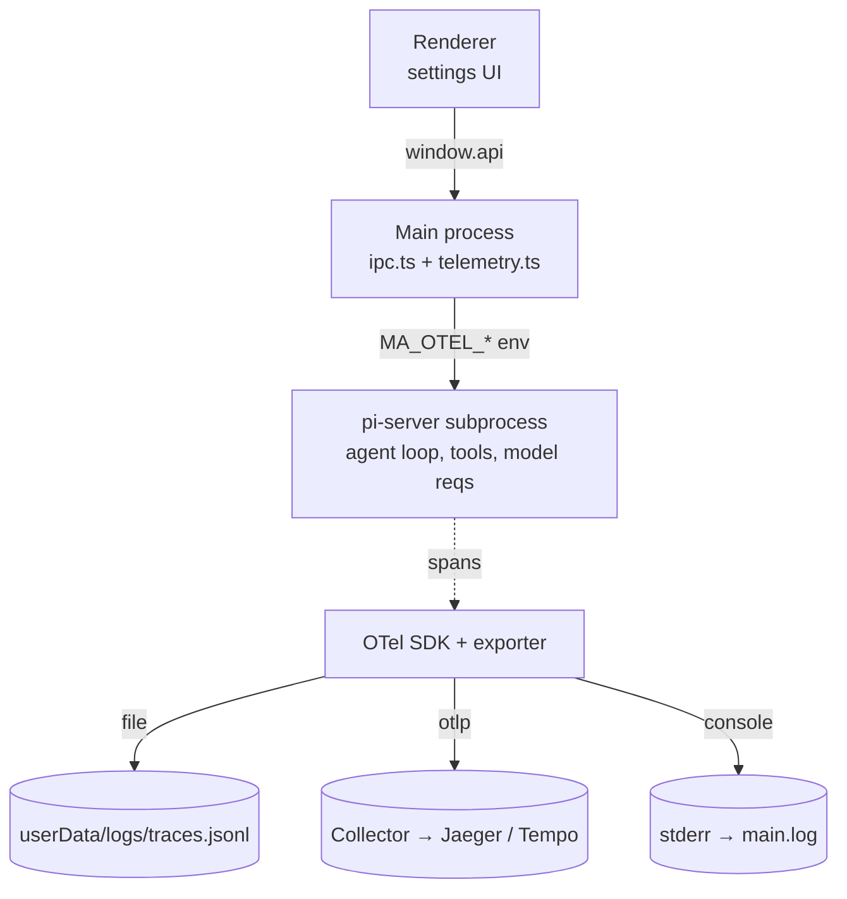

# OpenTelemetry (OTel) Tracing

Span-level observability of agent runs. The electron-free pi-server subprocess
emits **spans** (agent turns, model requests, tool calls) via the OpenTelemetry
Node SDK, using the **GenAI semantic conventions** so the output renders in any
GenAI-aware backend (Langfuse, Aspire, Grafana, Jaeger).

**Off by default**, metadata-only, opt-in via Settings → Telemetry. Disabled is
zero-overhead (the bootstrap returns the API's no-op tracer).

## Where things live

| Concern | File |
|---------|------|
| Tracer bootstrap (electron-free) | [`src/shared/otel.ts`](../src/shared/otel.ts) |
| Span instrumentation | [`src/main/pi-server/index.ts`](../src/main/pi-server/index.ts) |
| Persisted config (versioned JSON) + `telemetryEnv()` | [`src/main/storage/telemetry.ts`](../src/main/storage/telemetry.ts) |
| Env hand-off to subprocess | [`src/main/agent/backends/pi/agent.ts`](../src/main/agent/backends/pi/agent.ts) (`ensureSubprocess`) |
| IPC (`telemetry:get/save/tracesPath/reveal`) | [`src/main/ipc.ts`](../src/main/ipc.ts) |
| Settings UI | `src/renderer/src/components/settings/panels/TelemetryPanel.tsx` |

## Architecture

Spans are emitted from the **pi-server subprocess** — the agent loop, tool
dispatch, and model requests all run there, and that bundle is intentionally
**electron-free** (runs under `ELECTRON_RUN_AS_NODE`), which is exactly what the
OpenTelemetry Node SDK needs. Same constraint `sub-logger.ts` lives under.
stdout stays reserved for the JSONL protocol; spans go to a file, OTLP, or
stderr (console exporter) — never stdout.



## Span model

Span and attribute names follow the **OpenTelemetry GenAI semantic
conventions**. Span names are stable and low-cardinality; per-call detail goes
in attributes. `gen_ai.conversation.id` (= `session.id`) stitches a trace to the
`log.child({ sessionId })` lines.

```
invoke_agent minimalist-agent      one user message → assistant turn
│   attrs: gen_ai.operation.name=invoke_agent, gen_ai.agent.name,
│          gen_ai.provider.name, gen_ai.conversation.id, gen_ai.request.model,
│          minimalist_agent.llm_request_count, status (OK|ERROR),
│          session.id, turn.id, permission.mode, autonomy.level, pi.provider
│          (no gen_ai.usage.* here — usage lives on the child chat spans only;
│           see Token accounting)
├── chat <model>                    one provider/LLM call (SpanKind.CLIENT)
│     attrs: gen_ai.operation.name=chat, gen_ai.provider.name,
│            gen_ai.system (deprecated provider alias),
│            gen_ai.request.model, gen_ai.request.max_tokens,
│            gen_ai.response.{model,id}, gen_ai.response.finish_reasons[],
│            gen_ai.usage.{input,output,cache_read_input,cache_creation_input}_tokens,
│            gen_ai.server.time_to_first_token, server.address, error.type,
│            minimalist_agent.call_kind (mini_completion|llm_query standalone calls)
└── execute_tool <name>             one tool invocation
      attrs: gen_ai.operation.name=execute_tool, gen_ai.tool.{name,type,call.id,
             description}, gen_ai.conversation.id, error.type
```

A tool loop produces several `chat` + `execute_tool` children per turn. Token
usage is **not** rolled up onto `invoke_agent` — it stays on the per-call `chat`
spans (the turn carries only `minimalist_agent.llm_request_count`); see Token
accounting for why. Sub-agent subprocesses inherit the `MA_OTEL_*` env, so their
spans land in the same sink. Their `invoke_agent` span **nests under** the
parent's `execute_tool Agent` span: the parent injects a W3C `traceparent` onto
the sub-agent's prompt message (`MsgPrompt.traceparent`), and the child rebuilds
it as the parent context of its root span (see `injectTraceparent` /
`contextFromTraceparent` in [`otel.ts`](../src/shared/otel.ts)). They also share
`gen_ai.conversation.id`.

### Token accounting

pi-ai normalizes every provider's usage to
`{ input, output, cacheRead, cacheWrite, totalTokens }`. We report:

- `gen_ai.usage.input_tokens` = **total prompt** = `input + cacheRead + cacheWrite`
  (OpenAI-style: cached tokens are a *subset* of the prompt). pi-ai's `input` is
  only the *uncached* delta — with prompt caching that can be tiny (e.g. `2`) while
  the real prompt is thousands. Cost/usage dashboards sum `input_tokens`, so it
  must be the full prompt, not the delta.
- `gen_ai.usage.cache_read_input_tokens` / `cache_creation_input_tokens` = the
  cache split (the uncached delta is derivable: `input_tokens − cache_read −
  cache_creation`).
- `gen_ai.usage.output_tokens` = `output`.

Usage lives on the per-call **`chat`** spans only — it is deliberately **not**
rolled up onto `invoke_agent`, so a ledger that sums every token-bearing record
counts each model call exactly once (a turn-level duplicate would double-count).

### Content capture

`captureContent` defaults **off** → only metadata (counts, durations, names,
status). When on (local debugging) we populate the standard content attributes:
`gen_ai.input.messages` + `gen_ai.system_instructions` + `gen_ai.output.messages`
on `invoke_agent`/`chat`, and `gen_ai.tool.call.arguments` /
`gen_ai.tool.call.result` on `execute_tool`. **Secrets/tokens are never
captured** in either mode — same discipline as the logger.

## Configuration

Config is persisted **main-side** (versioned JSON via `json-store`), not
renderer `localStorage`, because the subprocess needs it at spawn and can't read
electron/localStorage. The settings UI writes it over IPC; `telemetryEnv()`
turns it into the env handed to the subprocess.

Env hand-off (parent → pi-server), alongside the existing `MA_LOG_LEVEL`:

```
MA_OTEL_ENABLED=1
MA_OTEL_CAPTURE_CONTENT=0
MA_OTEL_EXPORTER=file              # file | otlp | console (otlp-http/otlp-grpc aliases accepted)
MA_OTEL_OUTFILE=/…/userData/logs/traces.jsonl
MA_OTEL_OTLP_ENDPOINT=             # used when exporter=otlp
MA_OTEL_RESOURCE_ATTRIBUTES=user.name=alice,team.id=team-a
MA_OTEL_MAX_FILE_MB=5              # file exporter rotation cap (default 5; 0/invalid → 5)
```

Default traces file: `<userData>/logs/traces.jsonl`.

The `file` exporter is **size-capped** (default 5 MB, `MA_OTEL_MAX_FILE_MB`),
mirroring `main.log`: when it would exceed the cap it rotates to
`traces.jsonl.old` (single archive, overwritten each time), so disk use is
bounded at ~2× the cap. The byte count is tracked in memory (seeded once via
`statSync`), so there's no per-span `stat`. `console`/`otlp` don't write a file,
so the cap doesn't apply to them.

### JSONL line shape

The `file` exporter writes one span per line. The shape stays compatible with
tools that read the OpenTelemetry-JS record format:

- `attributes` — a flat `{ "gen_ai.usage.input_tokens": 17185, … }` map.
- `hrTime` — `[seconds, nanos]` start time (alongside the human-friendly
  `startTimeMs`/`durationMs`), so readers that key off `hrTime[0]` get the event
  time.
- `resource` — both a flat object **and** a `_rawAttributes` `[[key, value], …]`
  pair-array, so consumers that expect either form find `user.name`/`team.id`.

These extra fields are why MI's `traces.jsonl` is a drop-in source for external
per-user token-aggregation scripts — the per-call `chat` lines carry
`gen_ai.usage.*` + the resource identity, and tool/turn lines carry no usage so
they are skipped by a token-summing reader.

### Resource attributes (per-user token telemetry)

Every span carries an OTel **Resource**. By default it is just
`service.name=minimalist-agent` + `service.version`. Two extra sources are
merged in (later wins):

1. **`OTEL_RESOURCE_ATTRIBUTES`** — the *standard* W3C env var (`k1=v1,k2=v2`,
   values percent-encoded). Honored verbatim, so an external setup that exports
   it before launching the app needs zero in-app config.
2. **`MA_OTEL_RESOURCE_ATTRIBUTES`** — composed by the Telemetry settings from
   the **Display name** (`user.name`), **Team id** (`team.id`), and an advanced
   free-form field.

This lets a shared dashboard attribute token usage to a person: each
`traces.jsonl` line's `resource` carries `user.name`/`team.id`, and the
`gen_ai.usage.*_tokens` attributes on each `chat` span are the per-call counts an
aggregation script sums. Point `MA_OTEL_OUTFILE` (or settings → **Output file**)
at a synced/collected folder to feed such a pipeline.

## Guardrails (when changing this)

- OTel packages live in `package.json` **dependencies**, not devDependencies —
  they run in the subprocess runtime and electron-builder only packs
  `dependencies` (see AGENTS.md → Dependencies). They are externalized in
  `electron.vite.config.ts` (CJS-in-ESM breaks if bundled).
- Keep `src/shared/otel.ts` **electron-free** and **stdout-clean** — the
  subprocess reserves stdout for the JSONL protocol.
- Default **off**, **metadata-only**, **never record secrets**.
- Disabled must stay **zero-overhead** (no-op tracer when `MA_OTEL_ENABLED`
  unset).

## Follow-ups (not yet done)

1. **Metrics + log events** — a `gen_ai.client.token.usage` histogram (and
   operation-duration histogram) for cheap aggregation without replaying spans;
   currently spans only.
