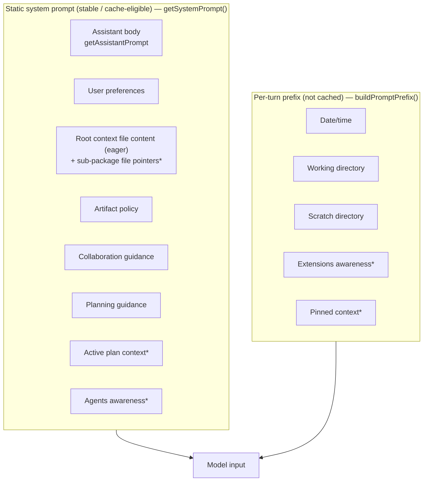

# System Prompt

The single source of truth for **what the model is told, where each piece comes
from, and the rules for changing it.** The prompt is assembled from many
scattered functions; this doc is the only place you can see the whole thing at
once. Keep it in sync when you touch any block (see [Maintenance](#7-maintenance)).

> TL;DR — adding to the system prompt is **cheap in tokens** (the stable prefix
> is cache-eligible wherever the provider supports prompt caching) but
> **expensive in attention** (every instruction competes with every other).
> Prefer *replacing* a line over *appending* one. Run the
> [add/change checklist](#6-checklist-before-you-touch-the-prompt) first.

---

## 1. Two assembly points

The prompt the model sees is **two concatenated pieces**, deliberately split so
the expensive part stays cacheable:

| Piece                    | Built by                                          | Lifetime                   | Cache-eligible?         | Why split                                                                 |
|--------------------------|---------------------------------------------------|----------------------------|-------------------------|---------------------------------------------------------------------------|
| **Static system prompt** | `getSystemPrompt()` → `buildSystemPromptAppend()` | Stable across a session    | **Provider-dependent**¹ | Keeps the cache-eligible prefix stable; per-turn churn would defeat it    |
| **Per-turn prefix**      | `buildPromptPrefix()`                             | Rebuilt every user message | No                      | Holds values that change each turn (clock, cwd, scratch path, extensions) |

Both live in [`src/main/agent/system-prompt.ts`](../src/main/agent/system-prompt.ts).
The static piece is passed to the backend as the `claude_code` preset's
`systemPrompt.append`; the per-turn prefix is prepended to the user message.

> ¹ **Prompt caching is the provider's, not ours** — there is no `cache_control`
> in this codebase. The **Anthropic backend** (SDK, `claude_code` preset) caches
> the system prompt. The **Pi backend** depends on the upstream model: OpenAI /
> Codex auto-cache long prefixes, GitHub Copilot and local servers may not cache
> at all. The static/per-turn split still helps **everywhere** — it preserves
> cache hits where they exist and isolates per-turn churn regardless.



`*` = conditionally included (see gating column below).

---

## 2. Full inventory

Sizes are **rough estimates** (`chars ÷ 4`), for relative weighting only — they
are not measured at runtime. "Gating" = when the block is present.

### Static system prompt — `getSystemPrompt()`

| Block                                                                                                                                                  | Source (function / file)                                         | Gating                         |  ~tokens |
|--------------------------------------------------------------------------------------------------------------------------------------------------------|------------------------------------------------------------------|--------------------------------|---------:|
| Environment marker                                                                                                                                     | `getEnvironmentMarker()`                                         | always                         |      ~30 |
| Assistant body (identity, capabilities, read-first, skills, extensions, mermaid, math, rich blocks, interaction guidelines, git co-author, web search) | `getAssistantPrompt()`                                           | always                         |   ~1,750 |
| User preferences                                                                                                                                       | `formatPreferencesForPrompt()` (`storage/preferences.ts`)        | when prefs set                 | ~150–400 |
| **Project context** — root file content injected eagerly (like Claude Code); sub-package files listed as read-on-demand pointers (monorepo). Walk depth capped at 4. | `getProjectContextFilesPrompt()`                                 | when AGENTS.md/CLAUDE.md found | ~200–2000 (root content) + ~30–150 (sub pointers) |
| **Artifact policy** (where to write files)                                                                                                             | `getArtifactPolicy()`                                            | always                         |     ~190 |
| Collaboration guidance                                                                                                                                 | `getCollaborationGuidance(autonomy)` (`collaboration-prompt.ts`) | always                         |   ~1,350 |
| Planning guidance                                                                                                                                      | `getPlanningGuidance()` (`planning-prompt.ts`)                   | always                         |   ~2,450 |
| Active plan context                                                                                                                                    | `formatActivePlanContext()` via `getActivePlan()`                | only when a plan is active     | ~100–400 |
| Agents awareness (terse: slug + tools + description, one prose line)                                                                                   | `loadAllAgents()` block (cached, 5-min TTL)                      | when AGENT.md agents exist     | ~120–400 |

**Static subtotal: ~6–9K tokens** when collaboration + planning + agents are all
present (the common case). Collaboration + planning alone are **~60%** of the baseline. The project context block now varies more widely — a terse AGENTS.md adds ~200 tokens; a detailed one can add ~2K.

### Per-turn prefix — `buildPromptPrefix()`

| Block                                                                                                                                                                                         | Source                                                    | Gating                                   |                                    ~tokens |
|-----------------------------------------------------------------------------------------------------------------------------------------------------------------------------------------------|-----------------------------------------------------------|------------------------------------------|-------------------------------------------:|
| Date/time                                                                                                                                                                                     | `getDateTimeContext()`                                    | always                                   |                                        ~50 |
| Working directory                                                                                                                                                                             | `getWorkingDirectoryContext()`                            | when cwd set                             |                                        ~60 |
| **Scratch directory**                                                                                                                                                                         | `getScratchDirContext()`                                  | when session path known                  |                                        ~30 |
| Extensions awareness (terse: flat slug list + one path-convention line; plus a gated "MCP not active" line when an enabled mcp-backed extension is blocked by consent/secret/connect failure) | `formatExtensionsAwareness()` (`extensions/directive.ts`) | when extensions installed                |                                    ~50–180 |
| **Pinned context** ("read these files" directive for skills/agents the user has pinned to the session — same pattern as `@mention`/`formatSkillDirective`, but persistent every turn)         | `buildPinnedContextBlock()` (`agent/system-prompt.ts`)    | when `session.pinnedAssets` is non-empty | ~10 tok per item (flat, path + label only) |

The extensions block grows with state (one *slug* per enabled extension) but is
now near-flat — it lists slugs only, not per-item descriptions or guide paths.
The capability *content* is pulled in on demand: the model reads `<extensionsDir>/<slug>/guide.md`
when it decides to use an extension, and an `@slug` mention auto-injects that
guide path via the mention directive (`skills/directive.ts`). This mirrors the
Skills lazy model and keeps per-turn attention focused on the task, not on every
installed tool.

Agents use the same philosophy in the static block, but keep a one-line
description per agent because they self-route (the model picks an agent via the
`Agent` tool — there is no `@mention` trigger to pull in detail on demand).

The **pinned context block** emits a "read these files" directive — the same
pattern as `@mention`/`formatSkillDirective` — so the model knows about pinned
items every turn without paying the full content cost per request. The model reads
the file when it needs to apply the instructions (one tool call), same as a
persistent `@mention`. Cost is flat: ~10 tokens per pinned item regardless of
content length. The 2 000-token warning in the UI is removed since it no longer
applies.

---

## 3. What is deliberately NOT in the prompt

Capabilities omitted **on purpose** because the app has no tool/render
architecture for them: live html-preview and pdf-preview panes, spreadsheet
rendering, browser tools, session-management tools, document CLIs, `call_llm`,
`transform_data`, `render_template`.

**But mind the nuance** — some adjacent things *do* render in model output and
shouldn't be confused with the omitted "preview" tools:

- **Inline images** (`` / ``) render with a click-to-expand lightbox.
- **Inline HTML** renders, but **sanitized** — `script`/`iframe`/`object`/`form`/
  `on*` are stripped (`rehype-sanitize`; renderer XSS = IPC RCE). So formatting
  HTML works; a live HTML *preview pane* does not.
- **PDFs** are input-only attachments — not rendered in output.

**Rule:** do not reintroduce guidance for a capability the app doesn't ship.
A prompt that describes tools the model doesn't have produces confident,
wrong behavior.

**Known gap (the inverse problem):** ` ```datatable ` *is* renderer-supported
([`DataTableBlock.tsx`](../src/renderer/src/components/chat/parts/markdown/DataTableBlock.tsx))
but has **no section in the prompt**, so the model never emits it. Either add a
short section (costs prompt budget — run the [checklist](#6-checklist-before-you-touch-the-prompt))
or accept that datatable is user-/renderer-only. Tracked, not yet decided.

---

## 4. The real cost model

Three costs, in priority order:

1. **Attention dilution (the binding constraint).** Every instruction competes
   for adherence. Past a point, more rules → *worse* instruction-following
   ("lost in the middle", instruction overload). This — not tokens — is why the
   prompt must stay lean.
2. **Maintenance.** Each block is one more thing to keep true as the app changes.
   Stale prompt text is worse than no text (it actively misleads the model).
3. **Tokens / $.** Mitigated *where the provider caches prompts* (Anthropic SDK;
   OpenAI/Codex automatically) — you then pay for the stable prefix roughly once
   per cache window. On backends without prompt caching (GitHub Copilot, local
   servers) you pay per turn — but the whole prompt is still <2% of a 200K
   context, so context-window pressure is negligible either way.

Consequence: **optimize for fewer, sharper instructions, not for token count.**

---

## 5. Budget

Soft ceilings — crossing them should force a conscious trade, not an automatic
"no":

- **Static prompt: ~8K tokens** (baseline without project context). Root context file content is additive on top — a typical AGENTS.md adds 200–500 tokens, a large one up to ~2K. Adding a new always-on block
  > 300 tokens should replace or shrink an existing one.
- **Per-turn prefix: ~300 tokens** excluding the extensions block (which scales
  with user-enabled extensions and is the user's choice) and the pinned context
  block (which is also user-controlled and warned above ~2 000 tokens in the UI).
- **New always-on blocks: default NO.** Prefer per-feature gating (like plan
  context / agents) so cost is paid only when the feature is in use.

---

## 6. Checklist (before you touch the prompt)

Answer these in the PR/commit description for any prompt change:

1. **Does it change behavior that happens *often*?** Rare cases rarely justify a
   permanent instruction. One-offs belong in the user's message, a skill, or
   AGENTS.md — not here.
2. **Can it live somewhere cheaper?** Preference order:
   `tool description` → `AGENTS.md` / `CLAUDE.md` → a **skill** (`@slug`,
   on-demand) → per-turn prefix → **static prompt (last resort).**
3. **Replace, don't append.** What existing line does this subsume or shorten?
4. **Static or per-turn?** If the value changes per turn, it goes in
   `buildPromptPrefix()`. If it's stable, `getSystemPrompt()` — never put
   per-turn data in the static block (it silently kills caching).
5. **Gate it if you can.** Only-when-relevant beats always-on (see plan context).
6. **Is it honest?** Don't describe a capability the app doesn't expose
   (see §3).
7. **Update this doc** — add the block to the inventory tables.

If a change can't answer #1 and #2 convincingly, it probably belongs in
AGENTS.md or a skill, not the system prompt.

### Pinned context block — checklist answers

1. **Happens often?** Only when the user explicitly pins something — fully opt-in, gated.
2. **Cheaper home?** No. The point is persistent in-context injection. A skill or AGENTS.md entry is per-project, not
   per-session. The per-turn prefix is the correct tier (value changes per session).
3. **Replace, don't append.** Does not subsume any existing block. It is additive but fully gated.
4. **Static or per-turn?** Per-turn prefix. Pinned assets are session-specific state that changes when the user
   pins/unpins — putting it in the static block would silently kill caching and be wrong.
5. **Gated?** Yes — block is absent when `pinnedAssets` is empty or undefined.
6. **Honest?** Yes. The model is given content for skills/agents the user has deliberately loaded. No phantom
   capabilities described.
7. **Doc updated?** ✔ (this section).

---

## 7. Maintenance

- This doc mirrors `getSystemPrompt()` and `buildPromptPrefix()` in
  [`system-prompt.ts`](../src/main/agent/system-prompt.ts). When you add, remove,
  or resize a block there, update the [inventory](#2-full-inventory).
- Sizes are estimates; if you want exact numbers, measure the assembled output
  at runtime (the prompt is built from live state — preferences, cwd, enabled
  agents/extensions — so it can't be measured statically).
- Related docs: [`COLLABORATION.md`](./COLLABORATION.md) and
  [`PLANNING_WORKFLOW.md`](./PLANNING_WORKFLOW.md) own the prose of their
  respective blocks — edit the behavior there, reflect the size here.
